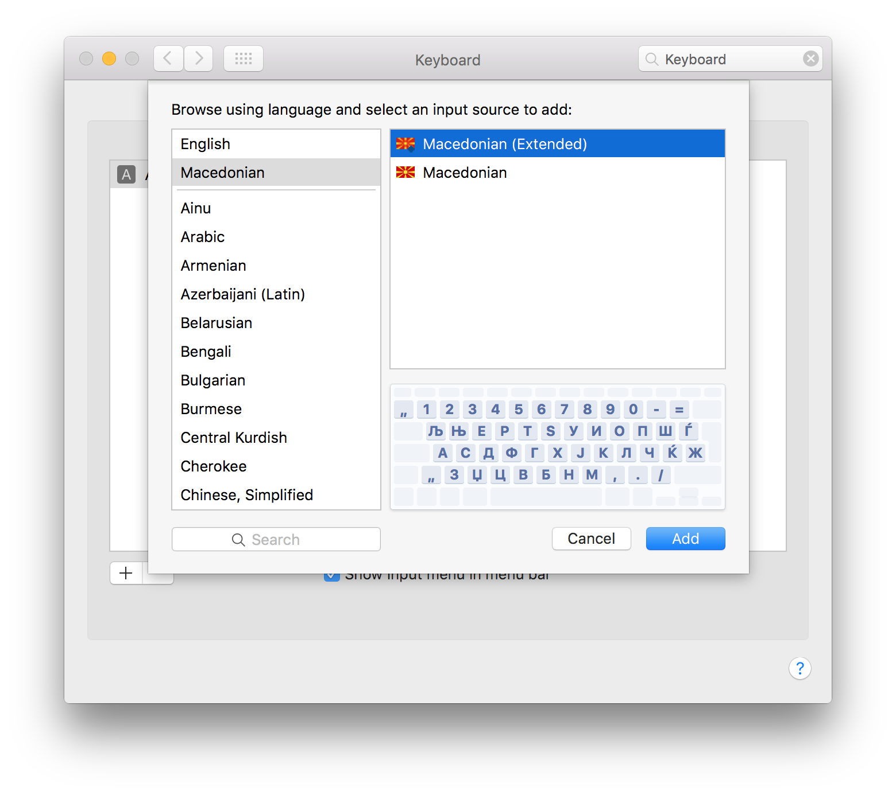

# Macedonian keyboard for OS X

The Macedonian system keyboard on OS X is missing some characters with diacritics (ѝ and ѐ), as well as some non-standard placement of special characters. This bundle fixes that issue.

## Installation

1. Download this [repository](https://github.com/bojan/osx-macedonian-keyboard/archive/master.zip).
2. Move `Macedonian (Extended).bundle` into `~/Library/Keyboard Layouts/`.
3. Log out from your account and log in again.
4. Open **System Preferences** > **Keyboard** > **Input Sources**.
5. Click **+ (Add)**.
6. Select **Macedonian** > **Macedonian (Extended)** and click **Add**.

## Credits

All credits for the original keyboard go to [**Vladimir Kochkovski**](https://plus.google.com/+ВладимирКочковски).

- http://blog.getvladimir.com/2014/10/os-x-yosemite.html
- https://www.youtube.com/watch?v=A4rxUl_DiS4

* * *

# Македонска тастатура за OS X

На системската македонска тастатура во OS X ѝ недостасуваат знаците со диакритици (ѝ и ѐ), а истотака и некои специјални знаци се наоѓаат на нестандардни места. Овој пакет го решава тој проблем.

## Инсталација

1. Сними го овој [репозиториум](https://github.com/bojan/osx-macedonian-keyboard/archive/master.zip).
2. Премести го `Macedonian (Extended).bundle` во `~/Library/Keyboard Layouts/`.
3. Одјави се од твојата сметка и повторно пријави се.
4. Отвори **System Preferences** > **Keyboard** > **Input Sources**.
5. Кликни на **+ (Add)**.
6. Избери **Macedonian** > **Macedonian (Extended)** и кликни **Add**.

## Заслуги

Сите заслуги одат кај авторот на оригиналната тастатура [**Владимир Кочковски**](https://plus.google.com/+ВладимирКочковски).

- http://blog.getvladimir.com/2014/10/os-x-yosemite.html
- https://www.youtube.com/watch?v=A4rxUl_DiS4
